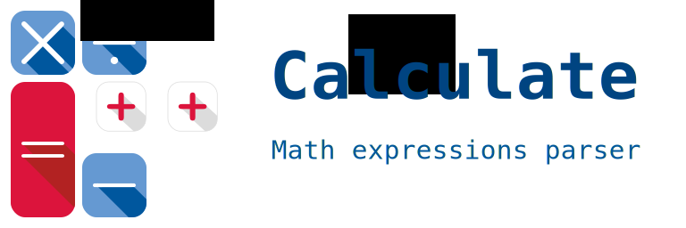

| Version | 2.0.0 |
| ------- | ---------|

---

[](https://github.com/newlawrence/Calculate/blob/7f96b434dd77461f17a71f3fe3025c21b73ed0d0/copying)
[](https://wandbox.org/permlink/d9OdoL5gJUYARsRz)
[](https://travis-ci.org/newlawrence/Calculate)
[](https://codecov.io/gh/newlawrence/Calculate)

Header-only library written in modern **C++** aiming for flexibility and ease of use. **Calculate** is not only a mathematical expressions parser but an engine built on top of the [Shunting Yard algorithm](https://en.wikipedia.org/wiki/Shunting-yard_algorithm).

The main objective of the library is to offer a clean and intuitive interface, where the expressions act and feel like regular functions. Another objective is to be completely configurable; from the data type to the tokenizing logic, the library is in fact a custom parser factory.


```c++
auto parser = calculate::DefaultParser{};
auto sum = parser.parse("x+y");

sum(1., 2.);  // returns 3.
```

**Warning:** *Fully C++14 standard compliant compiler required!*

### Features

* **Generic**. `double` and `std::complex<double>` parsers included by default.
* User defined constants, functions and operators.
* **Infix** and **postfix** notations supported.
* Regex-based customizable lexers.
* **Header-only**.

### Requirements

**Calculate** doesn't have any third party depedencies, the library should work with any compiler compatible with the **C++14** standard. List of currently tested compatible compilers:

* **gcc** version **5.1** and above.
* **clang** version **3.7** and above.
* **msvc** version **19.0** (**Visual C++ 14.0**) and above.
* **intel** version **16.0** and above.

**License:** MIT (see `copying`).
